# 统一认证授权中心

## 1. 背景

一般在一个公司内部可能有多个系统，比如OA，财务系统，CMS，ERP，营销系统，客服中心，项目管理系统，代码管理系统等等。

这些系统一般都有各自的`用户体系`，这意味着一些弊端：

* 使用者必须维护多个系统的账号密码，并且来回切换登录，非常不方便
* 对管理者来说，账号的管理，权限的分配等非常复杂，且不易维护

这就需要`统一认证授权中心`，也就是说，用户只需要一次登录，就可以访问各个系统，实现互联互通。

## 2. 认证授权概念

### 2.1 认证

证明身份的合法性。

比如：

* 账号密码
* 手机号+短信验证码
* 电子邮箱
* 身份证
* 指纹，人脸等信息

**以企业背景来说，认证就是判断此账号是否属于公司的合法账号**

### 2.2 授权

当用户身份合法后，不代表此用户拥有操作系统的权限。

这时候就需要`授权`，授权就是将权限赋予用户所拥有的账号/角色。

授权过后，在用户使用账号进行登录时，需要进行`鉴权`操作，判断此用户是否具有符合访问某个系统或者访问某个功能的权限，比如一个运营人员是不允许访问财务系统的(`运营人员的授权列表中并没有财务系统的授权`)。

## 3. 一些名词

`IAM(Identity and Access Management ) ` :  身份认证和访问管理。

`IDM(Identity Management System)`: 身份管理系统。

`SSO(SingleSignOn)`： 单点登录，用户只需要登录一次就可以访问所有相互信任的应用系统。

`RBAC(Role-Based Access Control)`: 基于角色的访问控制。是一种权限模型。

## 4. 常见的认证方案

### 4.1 JWT

HTTP协议是无状态的，这意味着我们无法通过HTTP访问来确认用户是否登录，有两种方案：

* session
* token

其中session方案，需要将session存储在服务端，并且需要cookie的配合，无法适应分布式场景以及客户端是手机端等这些无cookie的场景。

token方案就是登录成功后，服务端会下发一个令牌（token），客户端将token进行存储，这样访问资源时，将令牌token携带，服务端验证token有效性即可。

`JWT`是一种用于token生成的加密算法，是目前业界比较成熟的一种方案。

JWT字符串的组成：

> A.B.C，通过`.`进行相连，其中A部分为Header，B部分为Payload，C部分为Signature 

* Header: header部分一般会包含两部分：

  * typ：token类型，这里一般为`JWT`
  * alg：签名算法，一般填写`HS256`
  * 以BASE64加密json字符串，可以解密

  ~~~json
   {
     "alg": "HS256",
     "typ": "JWT"
   }
  ~~~

* Payload：可以添加需要传递的数据，比如用户id，还有几个默认的字段

  * iss (issuer)：签发人/发行人
  * sub (subject)：主题
  * aud (audience)：用户
  * exp (expiration time)：过期时间
  * nbf (Not Before)：生效时间，在此之前是无效的
  * iat (Issued At)：签发时间
  * jti (JWT ID)：用于标识该 JWT
  * 自定义字段
  * 以base64加密json字符串，可以解密，payload中不建议存放敏感数据

  ~~~json
  {
      //默认字段
      "sub":"主题123",
      //自定义字段
      "name":"码神之路www.mszlu.com",
  }
  ~~~

* Signature: 签名，指定一个secret(秘钥)，该secret需要保存起来，不让其他人知道，通过header中指明的加密算法，将上述header和payload进行加密，使用secret加盐，这就是`签名`

  * 验证时，收到一个`Header.Playload.Signature`这样的字符串，用secret加密`Header.Playload`，如果得到的结果和`Signature`一样，则验证通过
  * 签名同样是base64加密

### 4.2 OAuth2

`OAuth2`也是一种token认证方案，流程如下：

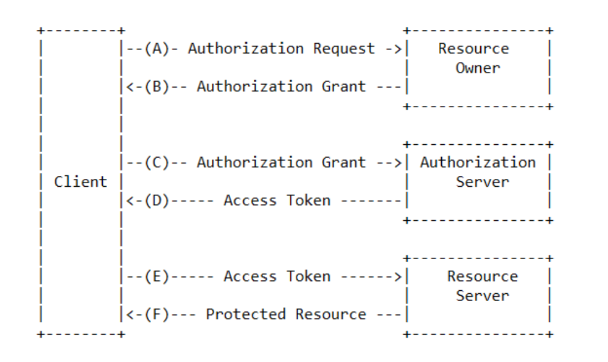

* 客户端（比如浏览器，手机APP等）
* 资源拥有者（用户）
* 认证服务器
* 资源服务器

认证流程：

* （A）用户打开客户端以后，客户端要求用户给予授权。
* （B）用户同意给予客户端授权。
* （C）客户端使用上一步获得的授权，向认证服务器申请令牌。
* （D）授权认证服务器对客户端进行认证以后，确认无误，同意发放令牌。
* （E）客户端使用令牌，向资源服务器申请获取资源。
* （F）资源服务器确认令牌无误，同意向客户端开放资源。

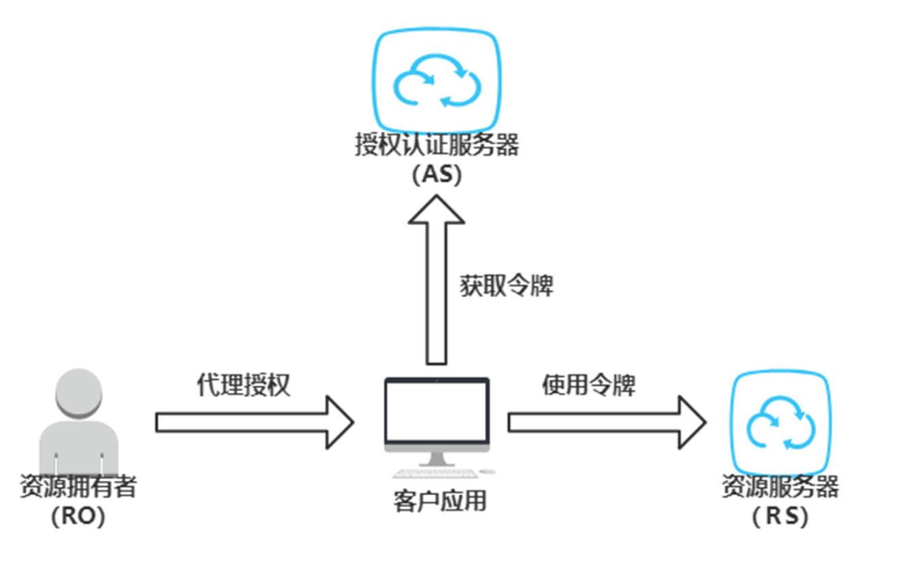

OAuth 2.0定义了四种授权许可类型：

1. Authorization Code：授权码

   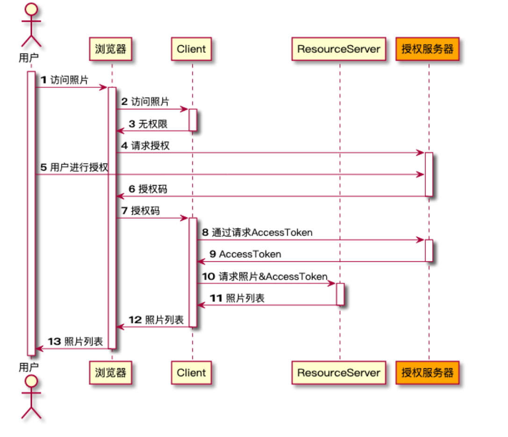

2. Implicit：隐式许可

   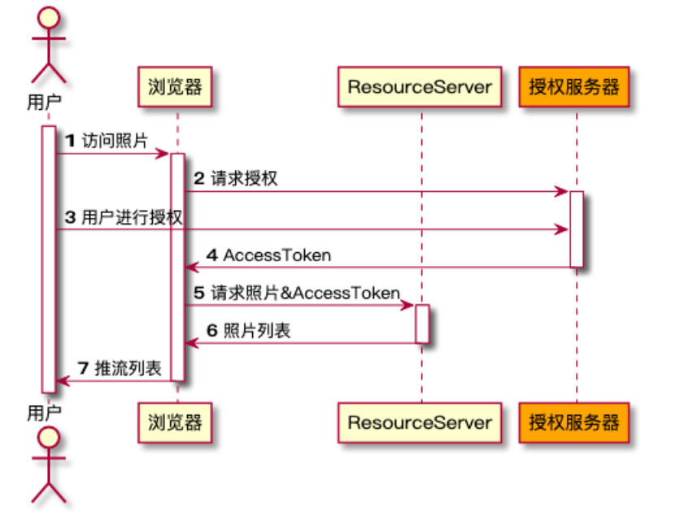

3. Resource Owner Password Credentials：密码凭证

   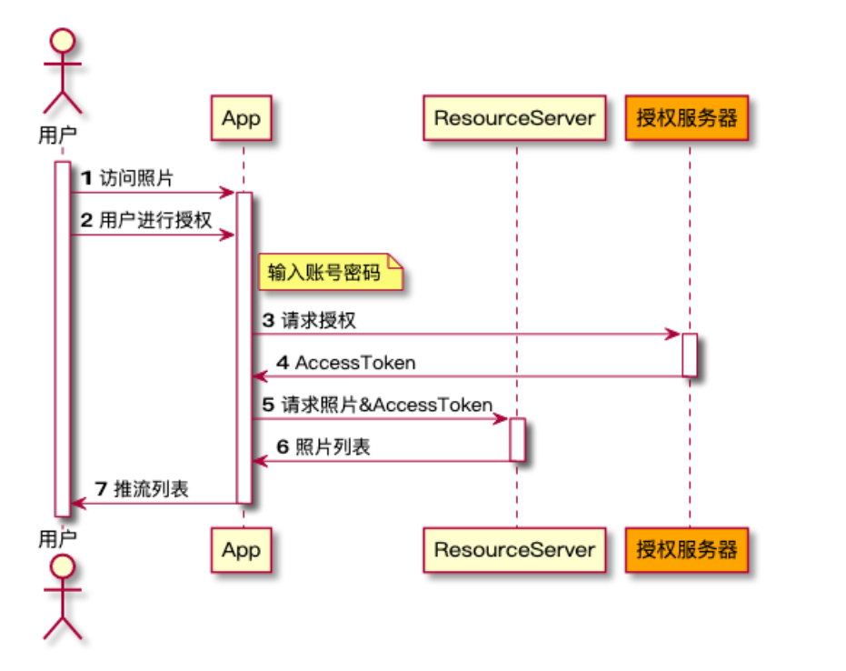

4. Client Credentials ：客户端凭证

​	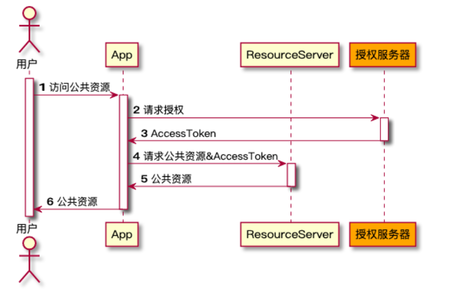

## 5. SSO协议

SSO就是单点登录，一次登录，可以访问所有受信应用，`JWT`和`OAuth`都可以实现单点登录。

### 5.1 OpenID Connect

简称`OIDC`，是基于OAuth2扩展出来的一个协议。 OIDC 在 OAuth2.0 协议的基础上，提供了用户认证、获取用户信息等的标准实现。**OIDC 是完全兼容 OAuth2.0 的**。

- `资源持有者（End User）` ： 对应 OAuth中的`Resource Owner`
- `客户端（Relying Party）`: 对应OAuth中的`Client`
- `资源服务器（Resource Server）` 
- `认证服务器（OpenID Provider）`: 对应OAuth中的`Auhtorization Server`

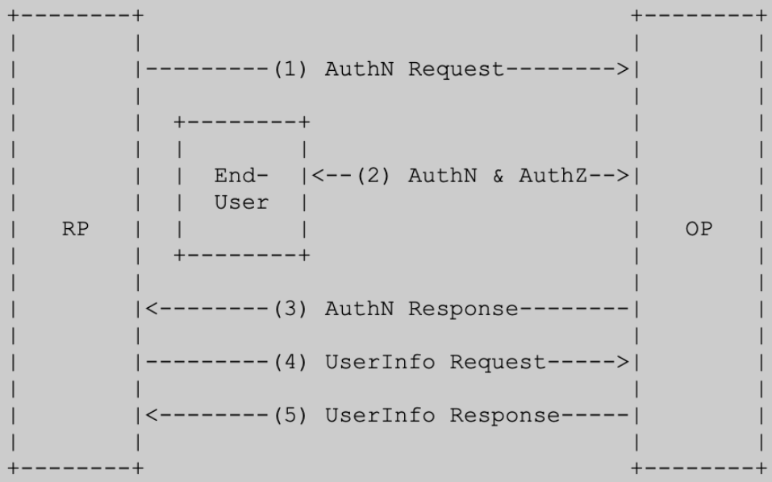

1. RP(client)发送一个认证请求到 OpenID Provider（OP）。
2. OP对End User进行认证并获得相应的授权。
3. OP返回一个ID Token或者access Token给RP。
4. RP使用access token向UserInfo Endpoint请求用户信息。
5. UserInfo Endpoint返回相应的用户信息给RP。

`ID Token`就像是一个用户的身份证，它是以JWT格式存在的，并且由OP进行签名，保证它的安全性。

> 授权模式：

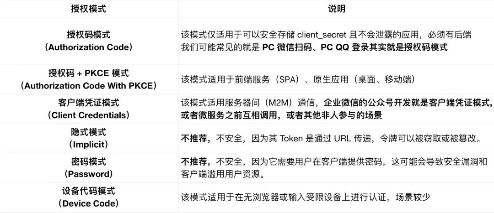

* **授权码模式（Authorization Code）**

  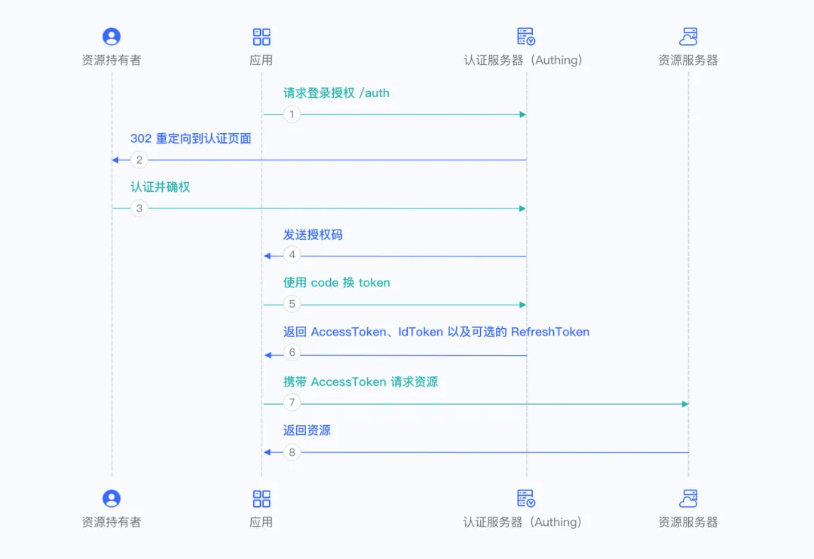

* **授权码 + PKCE 模式（Authorization Code With PKCE）**

  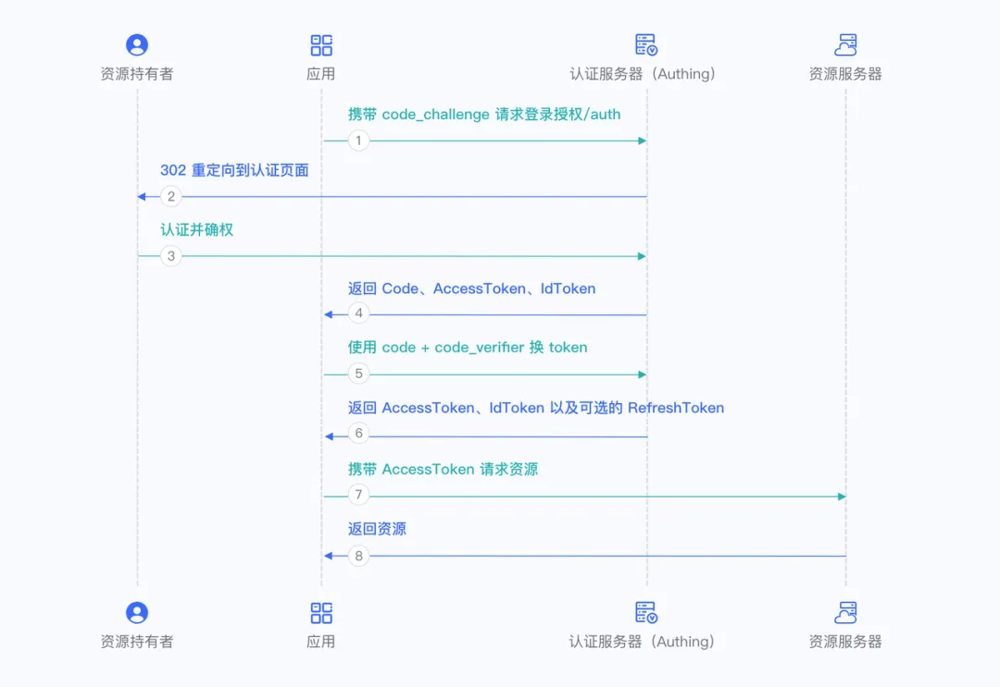

* **客户端凭证模式（Client Credentials）**

  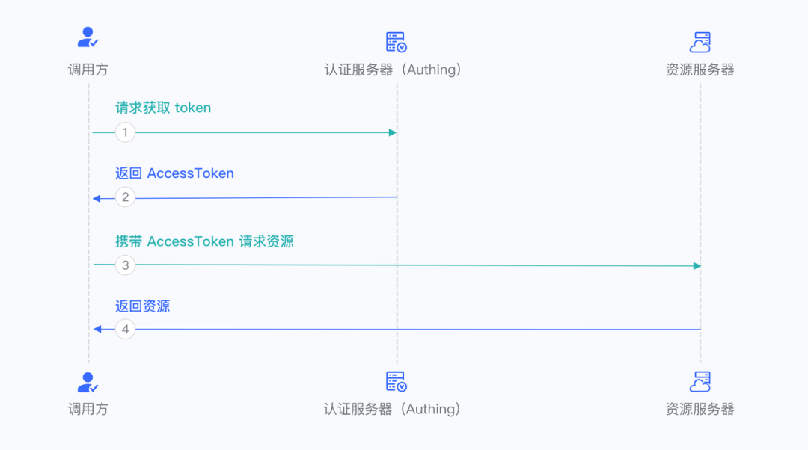

* **隐式模式（Implicit）**

  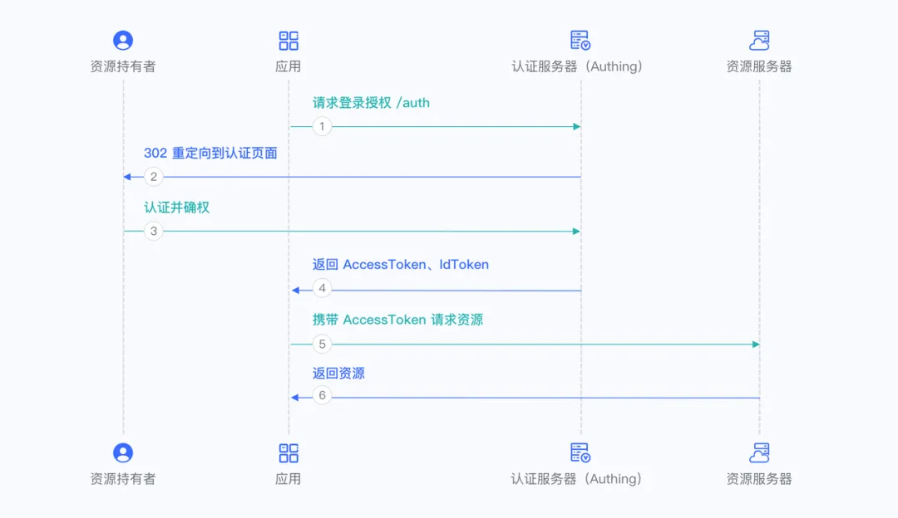

* **密码模式（Password）**

  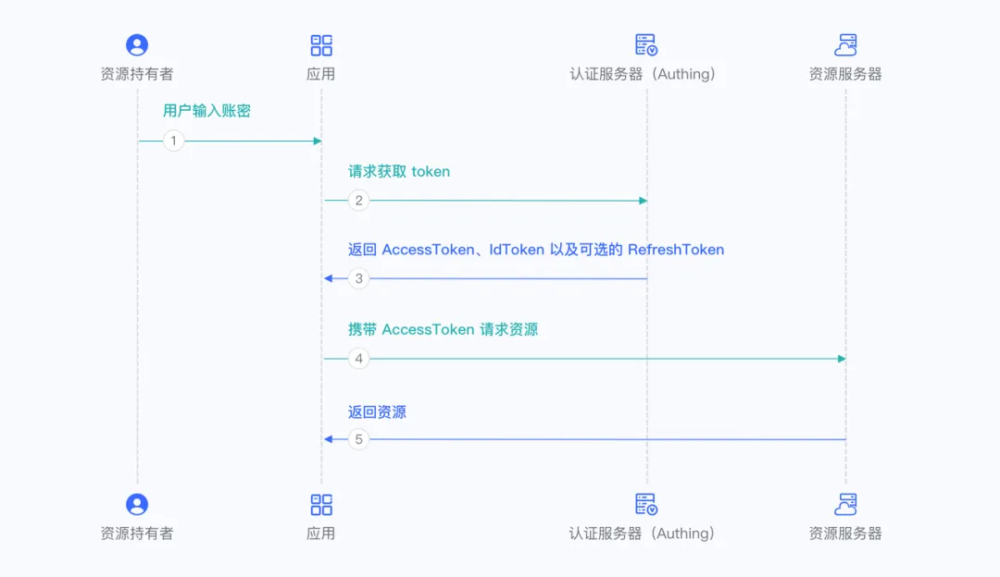

* **设备代码模式（Device Code）**

  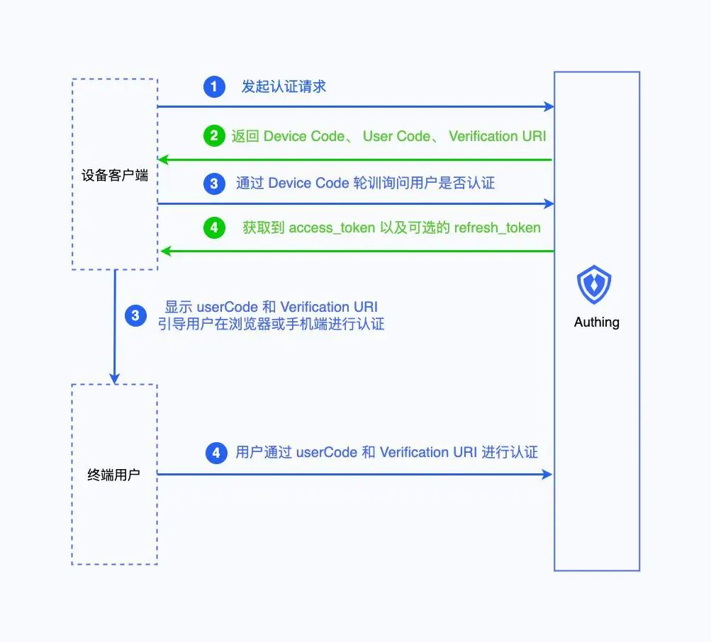

  

### 5.2 SAML 2.0

SAML协议全称为`Security Assertion Markup Language`，它是一个基于XML的标准协议。SAML标准定义了身份提供者（Identity Provider）和服务提供者（Service Provider）之间，如何通过SAML规范，采用加密和签名的方式来建立互信，从而交换用户身份信息。

**SAML复杂性比较高，并不推荐使用。**

### 5.3 CAS

CAS （ `Central Authentication Service` ） 是 Yale 大学发起的一个企业级的、开源的项目，旨在为 Web 应用系统提供一种可靠的单点登录解决方法。

CAS 开始于 2001 年， 并在 2004 年 12 月正式成为 JA-SIG 的一个项目。

角色介绍：

* CAS Client

  负责提供资源，当资源受保护时需要用户进行身份认证时，重定向到CAS Server进行认证。

* CAS Server

  负责对用户的认证。

CAS有不同的版本，比如1.0，2.0，3.0，4.0等，认证流程基本一致，只是不同版本中，Server可以引入不同的认证机制（比如引入SAML，OAuth2等）。

认证流程大致为: 

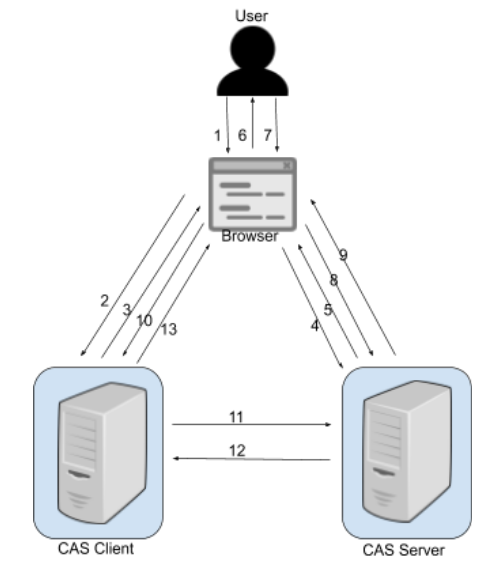

1. Client(终端用户)在浏览器里请求访问Web应用example；
2. 浏览器发起一个GET请求访问example应用的主页`https://www.example.com`；
3. 应用example发现当前用户处于未登陆状态，Redirect用户至CAS服务器进行认证；
4. 用户请求CAS服务器；
5. CAS发现当前用户在CAS服务器中处于未登陆状态, 要求用户必须得先登陆；
6. CAS服务器返回登陆页面至浏览器；
7. 用户在登陆界面中输入用户名和密码（或者其他认证方式）；
8. 用户把用户名和密码通过POST，提交至CAS服务器；
9. CAS对用户身份进行认证，若用户名和密码正确，则生成SSO会话,  且把会话ID通过Cookie的方式返回至用户的浏览器端（此时，用户在CAS服务端处于登陆状态）；
10. CAS服务器同时也会把用户重定向至CAS Client, 且同时发送一个Service Ticket；
11. CAS Client的服务端收到这个Service Ticket以后，请求CAS Server对该ticket进行校验；
12. CAS Server把校验结果返回给CAS Client, 校验结果包括该ticket是否合法，以及该ticket中包含对用户信息；
13. 至此，CAS Client根据Service Ticket得知当前登陆用户的身份，CAS Client处于登陆态。

**CAS同样不推荐使用**

> 虽然SAML和CAS不推荐使用，但做为统一认证授权中心的实现，需要考虑多种场景，同样应该给予实现（只是优先级不高）

**目前SSO协议，最为推荐使用的为OIDC，也是目前事实上的SSO通用标准**

## 6. RBAC

基于角色的访问控制（`Role-based access control`），指的是通过用户的角色（Role）授权其相关权限，这实现了更灵活的访问控制，相比直接授予用户权限，要更加简单、高效、可扩展。

当使用 RBAC 时，通过分析系统用户的实际情况，基于共同的职责和需求，授予他们不同角色。你可以授予给用户一个或多个角色，每个角色具有一个或多个权限，这种 `用户-角色`、`角色-权限` 间的关系，让我们可以不用再单独管理单个用户，用户从授予的角色里面继承所需的权限。

以一个简单的`场景`（Gitlab 的权限系统）为例，用户系统中有 Admin、Maintainer、Operator 三种角色，这三种角色分别具备不同的权限，比如只有 Admin 具备创建代码仓库、删除代码仓库的权限，其他的角色都不具备。

