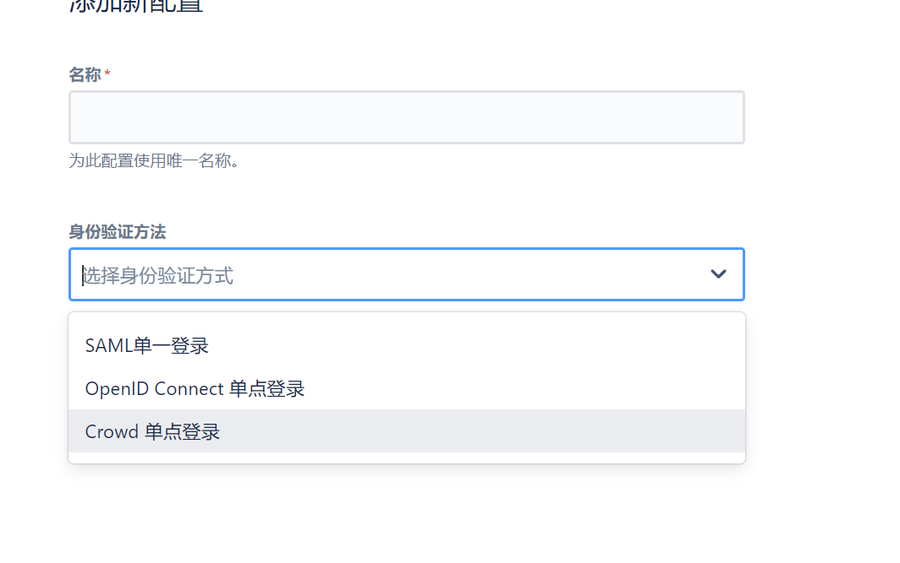
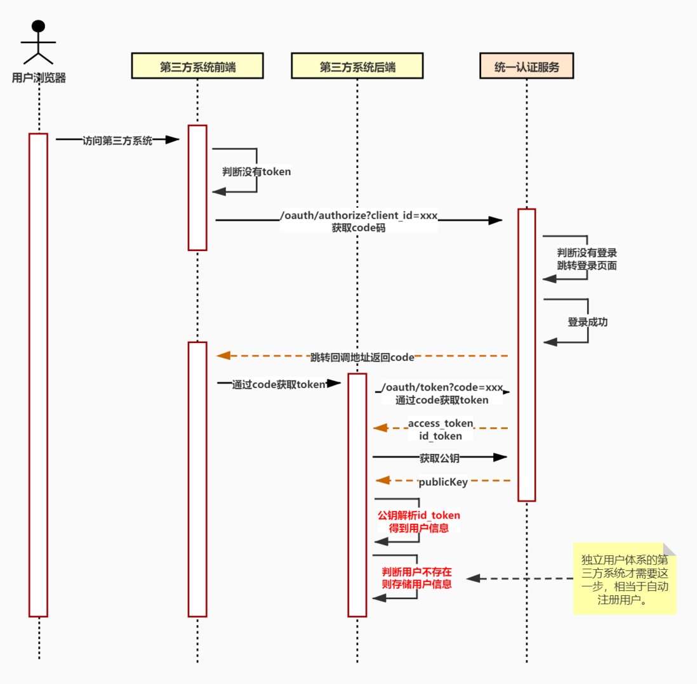
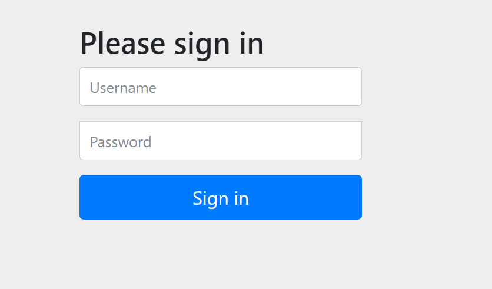
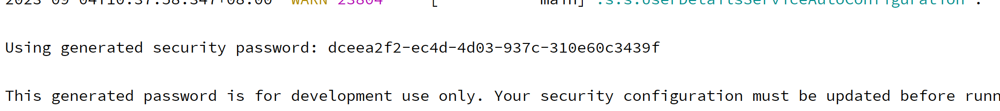
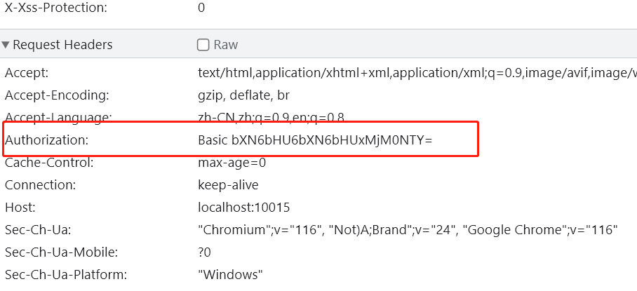
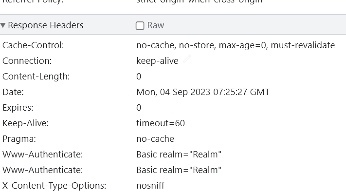
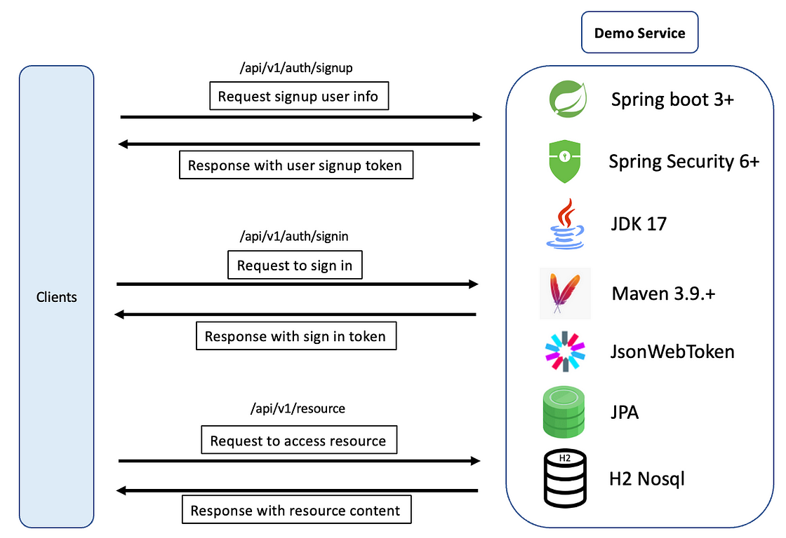

# JIRA单点登录-1

## 1. 安装JIRA

~~~yaml
jira-core:
    image: atlassian/jira-core:9.7.2-jdk11
    container_name: jira-core
    hostname: jira-core
    ports:
      - "8181:8080"
    restart: always
    tty: true
    volumes:
      - ${JIRA_DIR}/data:/var/atlassian/application-data/jira
      - ${JIRA_DIR}/mysql-connector-j-8.0.31.jar:/opt/atlassian/jira/atlassian-jira/WEB-INF/lib/mysql-connector-j-8.0.31.jar
~~~

> 注意安装后，访问8181端口，然后按照步骤安装即可，授权key可以去atlassian申请一个试用的即可，一个月有效期

## 2. OIDC

在设置中的身份验证方式中，我们看到JIRA支持三种方式的什么认证，这里我们先支持`OIDC`的单点登录方式。

## 3. Spring Security

一般我们实现认证授权（身份验证和访问控制）时都会选用`Spring Security`框架，所以我们先学习一下。

### 3.1 新建security项目

新建项目-> pom.xml：

~~~xml
<?xml version="1.0" encoding="UTF-8"?>
<project xmlns="http://maven.apache.org/POM/4.0.0"
         xmlns:xsi="http://www.w3.org/2001/XMLSchema-instance"
         xsi:schemaLocation="http://maven.apache.org/POM/4.0.0 http://maven.apache.org/xsd/maven-4.0.0.xsd">
    <parent>
        <artifactId>mszlu-auth</artifactId>
        <groupId>com.mszlu.auth</groupId>
        <version>0.0.1-SNAPSHOT</version>
    </parent>
    <modelVersion>4.0.0</modelVersion>

    <artifactId>security-test</artifactId>

    <properties>
        <maven.compiler.source>17</maven.compiler.source>
        <maven.compiler.target>17</maven.compiler.target>
    </properties>
    <dependencies>
        <dependency>
            <groupId>org.springframework.boot</groupId>
            <artifactId>spring-boot-starter-web</artifactId>
        </dependency>
        <!--核心安全依赖-->
        <dependency>
            <groupId>org.springframework.boot</groupId>
            <artifactId>spring-boot-starter-security</artifactId>
        </dependency>

        <dependency>
            <groupId>org.springframework.security</groupId>
            <artifactId>spring-security-test</artifactId>
            <scope>test</scope>
        </dependency>
    </dependencies>

</project>
~~~

~~~java
/*
 * Copyright [2023] [msauth of copyright http://www.douclouds.com]
 *
 * Licensed under the Apache License, Version 2.0 (the "License");
 * you may not use this file except in compliance with the License.
 * You may obtain a copy of the License at
 *
 *     http://www.apache.org/licenses/LICENSE-2.0
 *
 * Unless required by applicable law or agreed to in writing, software
 * distributed under the License is distributed on an "AS IS" BASIS,
 * WITHOUT WARRANTIES OR CONDITIONS OF ANY KIND, either express or implied.
 * See the License for the specific language governing permissions and
 * limitations under the License.
 */
package com.mszlu.msauth.security.controller;

import org.springframework.web.bind.annotation.GetMapping;
import org.springframework.web.bind.annotation.RestController;

/**
 * @author 码神之路
 */
@RestController
public class HelloController {

    @GetMapping("/hello")
    public String hello() {
        return "Hello, mszlu Spring Security";
    }
}

~~~

当我们访问接口时，会跳转到登录页面。

默认密码可以在控制台输出日志从看到：

默认账户是：user，将账户和密码输入，就可以正常访问接口。

我们也可以自己配置账户密码：

~~~yaml
server:
  port: 10015
spring:
  security:
    user:
      name: mszlu
      password: mszlu123456
~~~

### 3.2 Basic认证实现

1. 客户端首先发起一个未携带认证信息的请求
2. 服务器端返回一个401 Unauthorized的响应信息，并在WWW-Authentication头部中说明认证形式：当进行HTTP基本认证时，WWW-Authentication会被设置为`Basic realm=“Realm”`
3. 客户端会收到这个401 Unauthorized响应信息，并弹出一个对话框，询问用户名和密码。当用户输入后，客户端会将用户名和密码使用冒号进行拼接并用Base64编码，然后将其放入到请求的Authorization头部并发送给服务器
4. 服务器端对客户端发来的信息进行解码得到用户名和密码，并对该信息进行校验判断是否正确，最终给客户端返回响应内容

~~~java
/*
 * Copyright [2023] [msauth of copyright http://www.douclouds.com]
 *
 * Licensed under the Apache License, Version 2.0 (the "License");
 * you may not use this file except in compliance with the License.
 * You may obtain a copy of the License at
 *
 *     http://www.apache.org/licenses/LICENSE-2.0
 *
 * Unless required by applicable law or agreed to in writing, software
 * distributed under the License is distributed on an "AS IS" BASIS,
 * WITHOUT WARRANTIES OR CONDITIONS OF ANY KIND, either express or implied.
 * See the License for the specific language governing permissions and
 * limitations under the License.
 */
package com.mszlu.msauth.security.config;

import org.springframework.context.annotation.Bean;
import org.springframework.context.annotation.Configuration;
import org.springframework.security.config.Customizer;
import org.springframework.security.config.annotation.web.builders.HttpSecurity;
import org.springframework.security.web.SecurityFilterChain;

/**
 * @author 码神之路
 */
@Configuration
public class SecurityConfig{

     @Bean
    public SecurityFilterChain filterChain(HttpSecurity http) throws Exception {
        http
                .authorizeHttpRequests(auth -> auth.anyRequest().authenticated())
                .httpBasic(Customizer.withDefaults());
        return http.build();
    }
    
}

~~~

配置上述代码后，再次访问接口，弹出用户名密码输入框，输入后，正常访问。

当访问接口时，我们会在header中发现：

- WWW-Authenticate: 表示服务器告知浏览器进行代理认证工作。
- Basic: 表示认证类型为Basic认证。
- realm="Realm": 表示认证域名为Realm域。

> 注销Basic认证的方式，1. 关闭浏览器 2. 前端给出错误的`Authorization`

### 3.3 忽略认证URL

~~~java
@GetMapping("/noAuth")
    public String noAuth() {
        return "Hello, mszlu Spring Security No Auth";
    }
~~~

~~~java
 @Bean
    public WebSecurityCustomizer webSecurityCustomizer(){
        return web -> web.ignoring().requestMatchers("/noAuth");
    }
~~~

### 3.4 表单认证

~~~java
 @Bean
    public SecurityFilterChain filterChain(HttpSecurity http) throws Exception {
        http
                .authorizeHttpRequests(auth -> auth.anyRequest().authenticated())
                .formLogin(Customizer.withDefaults());
//            基本认证    .httpBasic(Customizer.withDefaults());
        return http.build();
    }
~~~

#### 3.4.1 自定义

自定义登录页面：

~~~html
<!DOCTYPE html>
<html>
<head>
    <meta name="viewport" content="width=device-width, initial-scale=1">
    
</head>
<body>

    <form class="animate" action="/login" method="post">
        

            
        

        

            <label ><b>Username</b></label>
            <input type="text" placeholder="Enter Username" name="username" required>

            <label><b>Password</b></label>
            <input type="password" placeholder="Enter Password" name="password" required>

            <button type="submit">Login</button>
            <label>
                <input type="checkbox" checked="checked" name="remember"> Remember me
            </label>
        

    </form>

</body>
</html>
~~~

配置

> 这时候，访问首页会发现跳转到了登录页面

~~~java
/*
 * Copyright [2023] [msauth of copyright http://www.douclouds.com]
 *
 * Licensed under the Apache License, Version 2.0 (the "License");
 * you may not use this file except in compliance with the License.
 * You may obtain a copy of the License at
 *
 *     http://www.apache.org/licenses/LICENSE-2.0
 *
 * Unless required by applicable law or agreed to in writing, software
 * distributed under the License is distributed on an "AS IS" BASIS,
 * WITHOUT WARRANTIES OR CONDITIONS OF ANY KIND, either express or implied.
 * See the License for the specific language governing permissions and
 * limitations under the License.
 */
package com.mszlu.msauth.security.config;

import org.springframework.context.annotation.Bean;
import org.springframework.context.annotation.Configuration;
import org.springframework.security.config.Customizer;
import org.springframework.security.config.annotation.web.builders.HttpSecurity;
import org.springframework.security.config.annotation.web.configuration.WebSecurityCustomizer;
import org.springframework.security.config.annotation.web.configurers.AbstractHttpConfigurer;
import org.springframework.security.web.SecurityFilterChain;

/**
 * @author 码神之路
 */
@Configuration
public class SecurityConfig{

    @Bean
    public SecurityFilterChain filterChain(HttpSecurity http) throws Exception {
        http
                .authorizeHttpRequests(auth -> auth.anyRequest().authenticated())
                .formLogin(auth-> auth
                        .loginPage("/myLogin.html")
                        .loginProcessingUrl("/login")
                        .permitAll())
                .csrf(AbstractHttpConfigurer::disable);//关闭csrf 否则登录会失败
        return http.build();
    }

    @Bean
    public WebSecurityCustomizer webSecurityCustomizer(){
        return web -> web.ignoring().requestMatchers("/noAuth");
    }
}

~~~

登录后正常跳转首页。

> 以上配置中，我们还可以配置登录`错误页面`，`注销处理url`，`登出页面`，`表单参数名`等

### 2.5 摘要认证

摘要认证和Basic认证一样，只是将传输的数据做加密处理。

在`WWW-Authentication`中会携带需要认证的参数，这个就是摘要信息。

相关参数如下：

* username: 用户名。

* password: 用户密码。

* realm: 认证域，由服务器返回。

* opaque: 透传字符串，客户端应原样返回。

* method: 请求的方法。

* nonce: 由服务器生成的随机字符串，包含过期时间(默认过期时间300s)和密钥。

* nc: 即nonce-count,指请求的次数，用于计数，防止重放攻击。qop被指定时，nc也必须被指定。

* cnonce: 客户端发给服务器的随机字符串，qop被指定时，cnonce也必须被指定。

* qop: 保护级别，客户端根据此参数指定摘要算法。若取值为 auth,则只进行身份验证；若取值为auth-int，则还需要校验内容完整性，默认的qop为auth。

* uri: 请求的uri。

* response: 客户端根据算法算出的摘要值，这个算法取决于qop。

* algorithm: 摘要算法，目前仅支持MD5。

* entity-body: 页面实体，非消息实体，仅在auth-int中支持。

### 2.6 jwt认证

#### 2.6.1 配置config

~~~java
/*
 * Copyright [2023] [msauth of copyright http://www.douclouds.com]
 *
 * Licensed under the Apache License, Version 2.0 (the "License");
 * you may not use this file except in compliance with the License.
 * You may obtain a copy of the License at
 *
 *     http://www.apache.org/licenses/LICENSE-2.0
 *
 * Unless required by applicable law or agreed to in writing, software
 * distributed under the License is distributed on an "AS IS" BASIS,
 * WITHOUT WARRANTIES OR CONDITIONS OF ANY KIND, either express or implied.
 * See the License for the specific language governing permissions and
 * limitations under the License.
 */
package com.mszlu.msauth.security.config;

import com.mszlu.msauth.security.filter.JwtAuthenticationFilter;
import com.mszlu.msauth.security.service.UserService;
import lombok.RequiredArgsConstructor;
import org.springframework.context.annotation.Bean;
import org.springframework.context.annotation.Configuration;
import org.springframework.http.HttpMethod;
import org.springframework.security.authentication.AuthenticationManager;
import org.springframework.security.authentication.AuthenticationProvider;
import org.springframework.security.authentication.UsernamePasswordAuthenticationToken;
import org.springframework.security.authentication.dao.DaoAuthenticationProvider;
import org.springframework.security.config.Customizer;
import org.springframework.security.config.annotation.authentication.configuration.AuthenticationConfiguration;
import org.springframework.security.config.annotation.web.builders.HttpSecurity;
import org.springframework.security.config.annotation.web.configuration.EnableWebSecurity;
import org.springframework.security.config.annotation.web.configuration.WebSecurityCustomizer;
import org.springframework.security.config.annotation.web.configurers.AbstractHttpConfigurer;
import org.springframework.security.config.http.SessionCreationPolicy;
import org.springframework.security.crypto.bcrypt.BCryptPasswordEncoder;
import org.springframework.security.crypto.password.PasswordEncoder;
import org.springframework.security.web.SecurityFilterChain;
import org.springframework.security.web.authentication.UsernamePasswordAuthenticationFilter;

/**
 * @author 码神之路
 */
@Configuration
@EnableWebSecurity
@RequiredArgsConstructor
public class SecurityConfig{

    private final UserService userService;
    private final JwtAuthenticationFilter jwtAuthenticationFilter;

    @Bean
    public SecurityFilterChain filterChain(HttpSecurity http) throws Exception {
        http
                .authorizeHttpRequests(auth -> auth
                                .anyRequest()
                                .authenticated())
                .sessionManagement(manager->manager.sessionCreationPolicy(SessionCreationPolicy.STATELESS))
                .authenticationProvider(authenticationProvider())
                .addFilterBefore(jwtAuthenticationFilter, UsernamePasswordAuthenticationFilter.class)
                .csrf(AbstractHttpConfigurer::disable)
                // 禁用basic明文验证
                .httpBasic(AbstractHttpConfigurer::disable)
                // 禁用默认登录页
                .formLogin(AbstractHttpConfigurer::disable)
                // 禁用默认登出页
                .logout(AbstractHttpConfigurer::disable);
        return http.build();
    }

    @Bean
    public WebSecurityCustomizer webSecurityCustomizer(){
        return web -> web.ignoring().requestMatchers(HttpMethod.GET,"/api/v1/user/login","noAuth");
    }
    @Bean
    public AuthenticationProvider authenticationProvider() {
        DaoAuthenticationProvider authProvider = new DaoAuthenticationProvider();
        authProvider.setUserDetailsService(userService.userDetailsService());
        authProvider.setPasswordEncoder(passwordEncoder());
        return authProvider;
    }

    @Bean
    public PasswordEncoder passwordEncoder() {
        return new BCryptPasswordEncoder();
    }

    @Bean
    public AuthenticationManager authenticationManager(AuthenticationConfiguration config)
            throws Exception {
        return config.getAuthenticationManager();
    }

}

~~~

#### 2.6.2 jwtFilter

~~~java
/*
 * Copyright [2023] [msauth of copyright http://www.douclouds.com]
 *
 * Licensed under the Apache License, Version 2.0 (the "License");
 * you may not use this file except in compliance with the License.
 * You may obtain a copy of the License at
 *
 *     http://www.apache.org/licenses/LICENSE-2.0
 *
 * Unless required by applicable law or agreed to in writing, software
 * distributed under the License is distributed on an "AS IS" BASIS,
 * WITHOUT WARRANTIES OR CONDITIONS OF ANY KIND, either express or implied.
 * See the License for the specific language governing permissions and
 * limitations under the License.
 */
package com.mszlu.msauth.security.filter;

import cn.hutool.core.text.CharSequenceUtil;
import cn.hutool.core.util.StrUtil;
import com.auth0.jwt.interfaces.Claim;
import com.mszlu.auth.utils.JWTUtil;
import com.mszlu.msauth.security.service.JwtService;
import com.mszlu.msauth.security.service.UserService;
import jakarta.servlet.FilterChain;
import jakarta.servlet.ServletException;
import jakarta.servlet.http.HttpServletRequest;
import jakarta.servlet.http.HttpServletResponse;
import lombok.RequiredArgsConstructor;
import org.springframework.security.authentication.UsernamePasswordAuthenticationToken;
import org.springframework.security.core.context.SecurityContext;
import org.springframework.security.core.context.SecurityContextHolder;
import org.springframework.security.core.userdetails.UserDetails;
import org.springframework.security.web.authentication.WebAuthenticationDetailsSource;
import org.springframework.stereotype.Component;
import org.springframework.web.filter.OncePerRequestFilter;

import java.io.IOException;
import java.util.Map;

/**
 * @author 码神之路
 */
@RequiredArgsConstructor
@Component
public class JwtAuthenticationFilter  extends OncePerRequestFilter {

    private final UserService userService;
    @Override
    protected void doFilterInternal(HttpServletRequest request, HttpServletResponse response, FilterChain filterChain) throws ServletException, IOException {
        final String authHeader = request.getHeader("Authorization");
        final String jwt;
        final String userName;
        if (CharSequenceUtil.isEmpty(authHeader) || !StrUtil.startWith(authHeader, "Bearer ")) {
            filterChain.doFilter(request, response);
            return;
        }
        jwt = authHeader.substring(7);
        Map<String, Claim> tokenInfo = JWTUtil.getTokenInfo(jwt, "123456");
        userName = tokenInfo.get("userName").asString();
        if (CharSequenceUtil.isNotEmpty(userName)
                && SecurityContextHolder.getContext().getAuthentication() == null) {
            UserDetails userDetails = userService.userDetailsService()
                    .loadUserByUsername(userName);
            if (userName.equals(userDetails.getUsername())) {
                SecurityContext context = SecurityContextHolder.createEmptyContext();
                UsernamePasswordAuthenticationToken authToken = new UsernamePasswordAuthenticationToken(
                        userDetails, null, userDetails.getAuthorities());
                authToken.setDetails(new WebAuthenticationDetailsSource().buildDetails(request));
                context.setAuthentication(authToken);
                SecurityContextHolder.setContext(context);
            }
        }
        filterChain.doFilter(request, response);
    }
}

~~~

#### 2.6.4 UserService

~~~java
/*
 * Copyright [2023] [msauth of copyright http://www.douclouds.com]
 *
 * Licensed under the Apache License, Version 2.0 (the "License");
 * you may not use this file except in compliance with the License.
 * You may obtain a copy of the License at
 *
 *     http://www.apache.org/licenses/LICENSE-2.0
 *
 * Unless required by applicable law or agreed to in writing, software
 * distributed under the License is distributed on an "AS IS" BASIS,
 * WITHOUT WARRANTIES OR CONDITIONS OF ANY KIND, either express or implied.
 * See the License for the specific language governing permissions and
 * limitations under the License.
 */
package com.mszlu.msauth.security.service;

import lombok.RequiredArgsConstructor;
import org.springframework.security.core.userdetails.User;
import org.springframework.security.core.userdetails.UserDetails;
import org.springframework.security.core.userdetails.UserDetailsService;
import org.springframework.security.core.userdetails.UsernameNotFoundException;
import org.springframework.security.crypto.bcrypt.BCryptPasswordEncoder;
import org.springframework.security.crypto.password.PasswordEncoder;
import org.springframework.stereotype.Service;

import java.util.Collections;

/**
 * @author 码神之路
 */
@Service
@RequiredArgsConstructor
public class UserService {

    public UserDetailsService userDetailsService() {
        return username -> {
            if ("mszlu".equals(username)){
                String password = "mszlu123456";
                String encode = new BCryptPasswordEncoder().encode(password);
                return new User(username,encode, Collections.EMPTY_LIST);
            }
            return null;
        };
    }
}

~~~

~~~java
/*
 * Copyright [2023] [msauth of copyright http://www.douclouds.com]
 *
 * Licensed under the Apache License, Version 2.0 (the "License");
 * you may not use this file except in compliance with the License.
 * You may obtain a copy of the License at
 *
 *     http://www.apache.org/licenses/LICENSE-2.0
 *
 * Unless required by applicable law or agreed to in writing, software
 * distributed under the License is distributed on an "AS IS" BASIS,
 * WITHOUT WARRANTIES OR CONDITIONS OF ANY KIND, either express or implied.
 * See the License for the specific language governing permissions and
 * limitations under the License.
 */
package com.mszlu.msauth.security.controller;

import com.mszlu.auth.utils.JWTUtil;
import org.springframework.security.core.Authentication;
import org.springframework.security.core.context.SecurityContextHolder;
import org.springframework.security.core.userdetails.UserDetails;
import org.springframework.web.bind.annotation.RequestMapping;
import org.springframework.web.bind.annotation.RestController;

import java.util.HashMap;
import java.util.Map;

/**
 * @author 码神之路
 */
@RestController
@RequestMapping("/api/v1/user")
public class UserController {

    @RequestMapping("login")
    public String login(String username, String password){
        if (username.equals("mszlu") && password.equals("mszlu123456")){
            Map<String, String> map = new HashMap<>();
            map.put("userName","mszlu");
            return JWTUtil.getToken(map,"123456");
        }
        return "账号或者密码不正确";
    }

    @RequestMapping("getInfo")
    public String getInfo(){
        Authentication authentication = SecurityContextHolder.getContext().getAuthentication();
        UserDetails userDetails = (UserDetails) authentication.getPrincipal();
        return userDetails.getUsername();
    }
}

~~~

> 使用postman进行测试，未登录情况下，是不能访问资源的，只有当登录后，携带jwt token才能通过验证

### 2.7 OAuth2

接下来，我们使用security支持oauth2，流程为：

* oauth2 client访问 oauth2 resource服务端资源
* 跳转认证服务器进行登录认证
* 登录成功，获得可访问权限，可以正常访问

#### 2.7.1 OAuth2认证端

~~~xml
<?xml version="1.0" encoding="UTF-8"?>
<project xmlns="http://maven.apache.org/POM/4.0.0"
         xmlns:xsi="http://www.w3.org/2001/XMLSchema-instance"
         xsi:schemaLocation="http://maven.apache.org/POM/4.0.0 http://maven.apache.org/xsd/maven-4.0.0.xsd">
    <parent>
        <artifactId>mszlu-auth</artifactId>
        <groupId>com.mszlu.auth</groupId>
        <version>0.0.1-SNAPSHOT</version>
    </parent>
    <modelVersion>4.0.0</modelVersion>

    <artifactId>oauth2-sso</artifactId>

    <properties>
        <maven.compiler.source>17</maven.compiler.source>
        <maven.compiler.target>17</maven.compiler.target>
    </properties>

    <dependencies>
        <dependency>
            <groupId>org.springframework.boot</groupId>
            <artifactId>spring-boot-starter-web</artifactId>
        </dependency>
        <!--核心安全依赖-->
        <dependency>
            <groupId>org.springframework.boot</groupId>
            <artifactId>spring-boot-starter-security</artifactId>
        </dependency>

        <dependency>
            <groupId>org.springframework.security</groupId>
            <artifactId>spring-security-test</artifactId>
            <scope>test</scope>
        </dependency>
        <dependency>
            <groupId>com.mszlu.auth</groupId>
            <artifactId>msauth-common</artifactId>
        </dependency>
        <dependency>
            <groupId>org.springframework.boot</groupId>
            <artifactId>spring-boot-starter-oauth2-authorization-server</artifactId>
        </dependency>
    </dependencies>
</project>
~~~

security配置：

~~~java
/*
 * Copyright [2023] [msauth of copyright http://www.douclouds.com]
 *
 * Licensed under the Apache License, Version 2.0 (the "License");
 * you may not use this file except in compliance with the License.
 * You may obtain a copy of the License at
 *
 *     http://www.apache.org/licenses/LICENSE-2.0
 *
 * Unless required by applicable law or agreed to in writing, software
 * distributed under the License is distributed on an "AS IS" BASIS,
 * WITHOUT WARRANTIES OR CONDITIONS OF ANY KIND, either express or implied.
 * See the License for the specific language governing permissions and
 * limitations under the License.
 */
package com.mszlu.msauth.security.sso.config;

import com.mszlu.msauth.security.sso.handler.CustomAuthenticationFailureHandler;
import com.nimbusds.jose.jwk.JWKSet;
import com.nimbusds.jose.jwk.RSAKey;
import com.nimbusds.jose.jwk.source.JWKSource;
import com.nimbusds.jose.proc.SecurityContext;
import org.springframework.context.annotation.Bean;
import org.springframework.context.annotation.Configuration;
import org.springframework.core.annotation.Order;
import org.springframework.security.config.Customizer;
import org.springframework.security.config.annotation.web.builders.HttpSecurity;
import org.springframework.security.config.annotation.web.configuration.WebSecurityCustomizer;
import org.springframework.security.core.userdetails.User;
import org.springframework.security.core.userdetails.UserDetailsService;
import org.springframework.security.crypto.bcrypt.BCryptPasswordEncoder;
import org.springframework.security.crypto.password.DelegatingPasswordEncoder;
import org.springframework.security.crypto.password.NoOpPasswordEncoder;
import org.springframework.security.crypto.password.PasswordEncoder;
import org.springframework.security.oauth2.core.AuthorizationGrantType;
import org.springframework.security.oauth2.core.ClientAuthenticationMethod;
import org.springframework.security.oauth2.core.oidc.OidcScopes;
import org.springframework.security.oauth2.jwt.JwtDecoder;
import org.springframework.security.oauth2.server.authorization.client.InMemoryRegisteredClientRepository;
import org.springframework.security.oauth2.server.authorization.client.RegisteredClient;
import org.springframework.security.oauth2.server.authorization.client.RegisteredClientRepository;
import org.springframework.security.oauth2.server.authorization.config.annotation.web.configuration.OAuth2AuthorizationServerConfiguration;
import org.springframework.security.oauth2.server.authorization.config.annotation.web.configurers.OAuth2AuthorizationServerConfigurer;
import org.springframework.security.oauth2.server.authorization.settings.AuthorizationServerSettings;
import org.springframework.security.provisioning.InMemoryUserDetailsManager;
import org.springframework.security.web.SecurityFilterChain;
import org.springframework.security.web.authentication.AuthenticationFailureHandler;
import org.springframework.security.web.authentication.LoginUrlAuthenticationEntryPoint;

import java.security.KeyPair;
import java.security.KeyPairGenerator;
import java.security.interfaces.RSAPrivateKey;
import java.security.interfaces.RSAPublicKey;
import java.util.UUID;

/**
 * @author 码神之路
 */
@Configuration
public class SecurityConfig {

    @Bean
    @Order(1)
    public SecurityFilterChain authFilterChain(HttpSecurity http) throws Exception {
        OAuth2AuthorizationServerConfiguration.applyDefaultSecurity(http);
        http.getConfigurer(OAuth2AuthorizationServerConfigurer.class)
                .oidc(Customizer.withDefaults());
        http.exceptionHandling(e->e.authenticationEntryPoint(new LoginUrlAuthenticationEntryPoint("/login")));
        http.oauth2ResourceServer(oauth->oauth.jwt(Customizer.withDefaults()));
        return http.build();
    }
    @Bean
    @Order(2)
    public SecurityFilterChain appFilterChain(HttpSecurity http) throws Exception {
        http.authorizeHttpRequests(auth->auth.anyRequest().authenticated());
        http.formLogin(Customizer.withDefaults());
        return http.build();
    }
    @Bean
    public UserDetailsService userDetailsService() {
        var user1 = User.withUsername("mszlu")
                .password(new BCryptPasswordEncoder().encode("123456"))
                .authorities("read")
                .build();
        return new InMemoryUserDetailsManager(user1);
    }
    @Bean
    public PasswordEncoder passwordEncoder() {
        return new BCryptPasswordEncoder();
    }
    @Bean
    public RegisteredClientRepository registeredClientRepository(){
        RegisteredClient registeredClient = RegisteredClient.withId(UUID.randomUUID().toString())
                .clientId("oauth2-test")
                .clientSecret(new BCryptPasswordEncoder().encode("123456"))
                .scope(OidcScopes.OPENID)
                .redirectUri("http://127.0.0.1:10014/login/oauth2/code/oauth2-test")
                .clientAuthenticationMethod(ClientAuthenticationMethod.CLIENT_SECRET_BASIC)
                .authorizationGrantType(AuthorizationGrantType.AUTHORIZATION_CODE)
                .build();

        return new InMemoryRegisteredClientRepository(registeredClient);
    }

    @Bean
    public AuthorizationServerSettings authorizationServerSettings(){
        return AuthorizationServerSettings.builder().build();
    }
    @Bean
    public JwtDecoder jwtDecoder(JWKSource<SecurityContext> jwkSource) {
        return OAuth2AuthorizationServerConfiguration.jwtDecoder(jwkSource);
    }
    @Bean
    public JWKSource<SecurityContext> jwkSource() {
        RSAKey rsaKey = generateRsa();
        JWKSet jwkSet = new JWKSet(rsaKey);
        return (jwkSelector, securityContext) -> jwkSelector.select(jwkSet);
    }

    public static RSAKey generateRsa() {
        KeyPair keyPair = generateRsaKey();
        RSAPublicKey publicKey = (RSAPublicKey) keyPair.getPublic();
        RSAPrivateKey privateKey = (RSAPrivateKey) keyPair.getPrivate();
        return new RSAKey.Builder(publicKey).privateKey(privateKey).keyID(UUID.randomUUID().toString()).build();
    }

    static KeyPair generateRsaKey() {
        KeyPair keyPair;
        try {
            KeyPairGenerator keyPairGenerator = KeyPairGenerator.getInstance("RSA");
            keyPairGenerator.initialize(2048);
            keyPair = keyPairGenerator.generateKeyPair();
        } catch (Exception ex) {
            throw new IllegalStateException(ex);
        }
        return keyPair;
    }

    @Bean
    public WebSecurityCustomizer webSecurityCustomizer(){
        return web -> web.ignoring().requestMatchers("/error");
    }
    @Bean
    public AuthenticationFailureHandler authenticationFailureHandler(){
        return new CustomAuthenticationFailureHandler();
    }
}

~~~

配置文件：

~~~yaml
server:
  port: 10013

~~~

#### 2.7.2 OAuth2 client

~~~xml
<?xml version="1.0" encoding="UTF-8"?>
<project xmlns="http://maven.apache.org/POM/4.0.0"
         xmlns:xsi="http://www.w3.org/2001/XMLSchema-instance"
         xsi:schemaLocation="http://maven.apache.org/POM/4.0.0 http://maven.apache.org/xsd/maven-4.0.0.xsd">
    <parent>
        <artifactId>mszlu-auth</artifactId>
        <groupId>com.mszlu.auth</groupId>
        <version>0.0.1-SNAPSHOT</version>
    </parent>
    <modelVersion>4.0.0</modelVersion>

    <artifactId>oauth2-client</artifactId>

    <properties>
        <maven.compiler.source>17</maven.compiler.source>
        <maven.compiler.target>17</maven.compiler.target>
    </properties>
    <dependencies>
        <dependency>
            <groupId>org.springframework.boot</groupId>
            <artifactId>spring-boot-starter-web</artifactId>
        </dependency>
        <!--核心安全依赖-->
        <dependency>
            <groupId>org.springframework.boot</groupId>
            <artifactId>spring-boot-starter-security</artifactId>
        </dependency>

        <dependency>
            <groupId>org.springframework.security</groupId>
            <artifactId>spring-security-test</artifactId>
            <scope>test</scope>
        </dependency>
        <dependency>
            <groupId>com.mszlu.auth</groupId>
            <artifactId>msauth-common</artifactId>
        </dependency>
        <dependency>
            <groupId>org.springframework.boot</groupId>
            <artifactId>spring-boot-starter-oauth2-client</artifactId>
        </dependency>
        <dependency>
            <groupId>org.springframework.boot</groupId>
            <artifactId>spring-boot-starter-webflux</artifactId>
        </dependency>
    </dependencies>
</project>
~~~

security配置：

~~~java
/*
 * Copyright [2023] [msauth of copyright http://www.douclouds.com]
 *
 * Licensed under the Apache License, Version 2.0 (the "License");
 * you may not use this file except in compliance with the License.
 * You may obtain a copy of the License at
 *
 *     http://www.apache.org/licenses/LICENSE-2.0
 *
 * Unless required by applicable law or agreed to in writing, software
 * distributed under the License is distributed on an "AS IS" BASIS,
 * WITHOUT WARRANTIES OR CONDITIONS OF ANY KIND, either express or implied.
 * See the License for the specific language governing permissions and
 * limitations under the License.
 */
package com.mszlu.msauth.security.client.config;

import lombok.RequiredArgsConstructor;
import org.springframework.context.annotation.Bean;
import org.springframework.context.annotation.Configuration;
import org.springframework.security.config.Customizer;
import org.springframework.security.config.annotation.web.builders.HttpSecurity;
import org.springframework.security.web.SecurityFilterChain;

/**
 * @author 码神之路
 */
@Configuration
@RequiredArgsConstructor
public class SecurityConfig {

    @Bean
    public SecurityFilterChain filterChain(HttpSecurity http) throws Exception {
        http
                .authorizeHttpRequests(auth -> auth
                                .anyRequest()
                                .authenticated())
                .oauth2Login(oauth2->oauth2.loginPage("/oauth2/authorization/oauth2-test"))
                .oauth2Client(Customizer.withDefaults());
        return http.build();
    }

}

~~~

配置文件：

~~~yaml
server:
  port: 10014
spring:
  security:
    oauth2:
      client:
        provider:
          spring:
            issuer-uri: http://localhost:10013
        registration:
          oauth2-test:
            provider: spring
            client-id: oauth2-test
            client-secret: "123456"
            scope:
              - openid
            authorization-grant-type: authorization_code
            redirect-uri: http://127.0.0.1:10014/login/oauth2/code/oauth2-test
~~~

访问资源服务：

~~~java
/*
 * Copyright [2023] [msauth of copyright http://www.douclouds.com]
 *
 * Licensed under the Apache License, Version 2.0 (the "License");
 * you may not use this file except in compliance with the License.
 * You may obtain a copy of the License at
 *
 *     http://www.apache.org/licenses/LICENSE-2.0
 *
 * Unless required by applicable law or agreed to in writing, software
 * distributed under the License is distributed on an "AS IS" BASIS,
 * WITHOUT WARRANTIES OR CONDITIONS OF ANY KIND, either express or implied.
 * See the License for the specific language governing permissions and
 * limitations under the License.
 */
package com.mszlu.msauth.security.client.cli;

import org.springframework.web.service.annotation.GetExchange;
import org.springframework.web.service.annotation.HttpExchange;

/**
 * @author 码神之路
 */
@HttpExchange("http://localhost:10012")
public interface HomeClient {
    @GetExchange("/")
    String getHome();
}

~~~

~~~java
/*
 * Copyright [2023] [msauth of copyright http://www.douclouds.com]
 *
 * Licensed under the Apache License, Version 2.0 (the "License");
 * you may not use this file except in compliance with the License.
 * You may obtain a copy of the License at
 *
 *     http://www.apache.org/licenses/LICENSE-2.0
 *
 * Unless required by applicable law or agreed to in writing, software
 * distributed under the License is distributed on an "AS IS" BASIS,
 * WITHOUT WARRANTIES OR CONDITIONS OF ANY KIND, either express or implied.
 * See the License for the specific language governing permissions and
 * limitations under the License.
 */
package com.mszlu.msauth.security.client.config;

import com.mszlu.msauth.security.client.cli.HomeClient;
import org.springframework.context.annotation.Bean;
import org.springframework.context.annotation.Configuration;
import org.springframework.security.oauth2.client.OAuth2AuthorizedClientManager;
import org.springframework.security.oauth2.client.OAuth2AuthorizedClientProvider;
import org.springframework.security.oauth2.client.OAuth2AuthorizedClientProviderBuilder;
import org.springframework.security.oauth2.client.registration.ClientRegistrationRepository;
import org.springframework.security.oauth2.client.web.DefaultOAuth2AuthorizedClientManager;
import org.springframework.security.oauth2.client.web.OAuth2AuthorizedClientRepository;
import org.springframework.security.oauth2.client.web.reactive.function.client.ServletOAuth2AuthorizedClientExchangeFilterFunction;
import org.springframework.web.reactive.function.client.WebClient;
import org.springframework.web.reactive.function.client.support.WebClientAdapter;
import org.springframework.web.service.invoker.HttpServiceProxyFactory;

/**
 * @author 码神之路
 */
@Configuration
public class WebClientConfig {
    /**
     * 创建名为 welcomeClient 的 bean，类型为 WelcomeClient。
     * 使用 OAuth2AuthorizedClientManager 作为参数创建 HttpServiceProxyFactory，然后使用它创建客户端。
     *
     * @param authorizedClientManager 用于创建 HttpServiceProxyFactory 的 OAuth2AuthorizedClientManager 实例
     * @return WelcomeClient 实例
     * @throws Exception 如果创建客户端时发生错误，则抛出异常
     */
    @Bean
    public HomeClient homeClient(OAuth2AuthorizedClientManager authorizedClientManager) throws Exception {
        return httpServiceProxyFactory(authorizedClientManager).createClient(HomeClient.class);
    }

    /**
     * 创建 HttpServiceProxyFactory，以便在创建客户端时使用。
     *
     * @param authorizedClientManager 用于创建 HttpServiceProxyFactory 的 OAuth2AuthorizedClientManager 实例
     * @return 创建的 HttpServiceProxyFactory 实例
     */
    private HttpServiceProxyFactory httpServiceProxyFactory(OAuth2AuthorizedClientManager authorizedClientManager) {
        // 创建 ServletOAuth2AuthorizedClientExchangeFilterFunction，使用它来处理 OAuth2 认证
        ServletOAuth2AuthorizedClientExchangeFilterFunction oauth2Client =
                new ServletOAuth2AuthorizedClientExchangeFilterFunction(authorizedClientManager);

        // 设置默认的 OAuth2 授权客户端
        oauth2Client.setDefaultOAuth2AuthorizedClient(true);

        // 创建 WebClient，应用 OAuth2 认证配置
        WebClient webClient = WebClient.builder()
                .apply(oauth2Client.oauth2Configuration())
                .build();

        // 创建 WebClientAdapter，它允许我们在创建客户端时使用 WebClient
        WebClientAdapter client = WebClientAdapter.forClient(webClient);

        // 创建 HttpServiceProxyFactory，它可用于创建客户端
        return HttpServiceProxyFactory.builder(client).build();
    }

    /**
     * 创建 OAuth2AuthorizedClientManager 的 bean。
     *
     * @param clientRegistrationRepository 用于管理客户端注册信息的 ClientRegistrationRepository 实例
     * @param authorizedClientRepository   用于管理授权客户端信息的 OAuth2AuthorizedClientRepository 实例
     * @return OAuth2AuthorizedClientManager 实例
     */
    @Bean
    public OAuth2AuthorizedClientManager authorizedClientManager(
            ClientRegistrationRepository clientRegistrationRepository,
            OAuth2AuthorizedClientRepository authorizedClientRepository) {

        // 创建 OAuth2AuthorizedClientProvider，用于获取授权客户端
        OAuth2AuthorizedClientProvider authorizedClientProvider =
                OAuth2AuthorizedClientProviderBuilder.builder()
                        .authorizationCode()
                        .refreshToken()
                        .build();

        // 创建 DefaultOAuth2AuthorizedClientManager，使用它来管理授权客户端
        DefaultOAuth2AuthorizedClientManager authorizedClientManager =
                new DefaultOAuth2AuthorizedClientManager(
                        clientRegistrationRepository, authorizedClientRepository);

        // 设置授权客户端提供程序
        authorizedClientManager.setAuthorizedClientProvider(authorizedClientProvider);

        // 返回 OAuth2AuthorizedClientManager
        return authorizedClientManager;
    }
}

~~~

~~~java
/*
 * Copyright [2023] [msauth of copyright http://www.douclouds.com]
 *
 * Licensed under the Apache License, Version 2.0 (the "License");
 * you may not use this file except in compliance with the License.
 * You may obtain a copy of the License at
 *
 *     http://www.apache.org/licenses/LICENSE-2.0
 *
 * Unless required by applicable law or agreed to in writing, software
 * distributed under the License is distributed on an "AS IS" BASIS,
 * WITHOUT WARRANTIES OR CONDITIONS OF ANY KIND, either express or implied.
 * See the License for the specific language governing permissions and
 * limitations under the License.
 */
package com.mszlu.msauth.security.client.controller;

import com.mszlu.msauth.security.client.cli.HomeClient;
import lombok.RequiredArgsConstructor;
import org.springframework.web.bind.annotation.RequestMapping;
import org.springframework.web.bind.annotation.RestController;

/**
 * @author 码神之路
 */
@RestController
@RequiredArgsConstructor
public class HelloController {

    private final HomeClient homeClient;

    @RequestMapping("hello")
    public String hello(){
        return homeClient.getHome();
    }
}

~~~

#### 2.7.3 OAuth2 资源服务

pom.xml：

~~~xml
<?xml version="1.0" encoding="UTF-8"?>
<project xmlns="http://maven.apache.org/POM/4.0.0"
         xmlns:xsi="http://www.w3.org/2001/XMLSchema-instance"
         xsi:schemaLocation="http://maven.apache.org/POM/4.0.0 http://maven.apache.org/xsd/maven-4.0.0.xsd">
    <parent>
        <artifactId>mszlu-auth</artifactId>
        <groupId>com.mszlu.auth</groupId>
        <version>0.0.1-SNAPSHOT</version>
    </parent>
    <modelVersion>4.0.0</modelVersion>

    <artifactId>oauth2-resource-server</artifactId>

    <properties>
        <maven.compiler.source>17</maven.compiler.source>
        <maven.compiler.target>17</maven.compiler.target>
    </properties>

    <dependencies>
        <dependency>
            <groupId>org.springframework.boot</groupId>
            <artifactId>spring-boot-starter-web</artifactId>
        </dependency>
        <!--核心安全依赖-->
        <dependency>
            <groupId>org.springframework.boot</groupId>
            <artifactId>spring-boot-starter-security</artifactId>
        </dependency>

        <dependency>
            <groupId>org.springframework.security</groupId>
            <artifactId>spring-security-test</artifactId>
            <scope>test</scope>
        </dependency>
        <dependency>
            <groupId>com.mszlu.auth</groupId>
            <artifactId>msauth-common</artifactId>
        </dependency>
        <dependency>
            <groupId>org.springframework.boot</groupId>
            <artifactId>spring-boot-starter-oauth2-resource-server</artifactId>
        </dependency>
    </dependencies>
</project>
~~~

security配置：

~~~java
/*
 * Copyright [2023] [msauth of copyright http://www.douclouds.com]
 *
 * Licensed under the Apache License, Version 2.0 (the "License");
 * you may not use this file except in compliance with the License.
 * You may obtain a copy of the License at
 *
 *     http://www.apache.org/licenses/LICENSE-2.0
 *
 * Unless required by applicable law or agreed to in writing, software
 * distributed under the License is distributed on an "AS IS" BASIS,
 * WITHOUT WARRANTIES OR CONDITIONS OF ANY KIND, either express or implied.
 * See the License for the specific language governing permissions and
 * limitations under the License.
 */
package com.mszlu.msauth.security.server.config;

import org.springframework.beans.factory.annotation.Value;
import org.springframework.context.annotation.Bean;
import org.springframework.context.annotation.Configuration;
import org.springframework.security.config.annotation.web.builders.HttpSecurity;
import org.springframework.security.oauth2.jwt.JwtDecoders;
import org.springframework.security.web.SecurityFilterChain;

/**
 * @author 码神之路
 */
@Configuration
public class SecurityConfig {

    @Value("${spring.security.oauth2.resourceserver.jwt.issuer-uri}")
    String issuerUri;

    @Bean
    public SecurityFilterChain filterChain(HttpSecurity http) throws Exception {
        http.authorizeHttpRequests(auth->auth.anyRequest().authenticated())
                .oauth2ResourceServer(oauth2->oauth2.jwt(jwt->jwt.decoder(JwtDecoders.fromIssuerLocation(issuerUri))));
        return http.build();
    }
}

~~~

接口：

~~~java
/*
 * Copyright [2023] [msauth of copyright http://www.douclouds.com]
 *
 * Licensed under the Apache License, Version 2.0 (the "License");
 * you may not use this file except in compliance with the License.
 * You may obtain a copy of the License at
 *
 *     http://www.apache.org/licenses/LICENSE-2.0
 *
 * Unless required by applicable law or agreed to in writing, software
 * distributed under the License is distributed on an "AS IS" BASIS,
 * WITHOUT WARRANTIES OR CONDITIONS OF ANY KIND, either express or implied.
 * See the License for the specific language governing permissions and
 * limitations under the License.
 */
package com.mszlu.msauth.security.server.controller;

import org.springframework.web.bind.annotation.GetMapping;
import org.springframework.web.bind.annotation.RestController;

import java.time.LocalDateTime;

/**
 * @author 码神之路
 */
@RestController
public class ResourceController {

    @GetMapping("/")
    public String home() {
        LocalDateTime time = LocalDateTime.now();
        return "Welcome Resource Server! - " + time;
    }
}

~~~

配置：

~~~yaml
server:
  port: 10012
spring:
  security:
    oauth2:
      resourceserver:
        jwt:
          issuer-uri: http://localhost:10013

~~~

> 测试

* 访问`http://127.0.0.1:10014/hello`
* 跳转到10013的sso认证服务进行登录（这其中做了oauth2的一系列事情，获取code，获取token等操作）
* 登录成功，可以正常访问
